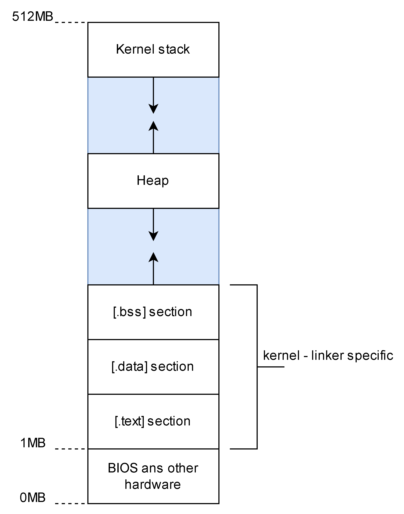

# operating_systems
Repository for operating systems

## Required tools
You'll need a cross-compiler toolchain to build code for your target machine (i386) from your host machine (likely x86_64).

```bash
sudo apt-get update
sudo apt install build-essential nasm qemu-system-x86
```

- build-essential: Includes the GCC compiler, make, and other essential utilities.
- nasm: A popular assembler for x86.
- genisoimage: We'll use this to create a bootable ISO file.
- qemu-system-x86: A fantastic emulator to test your OS without needing a physical machine.

## Prepare codeset
You can skip this section if you just want to run my code under [Run your OS](#run-your-os).

### 1. Assembly code
This file include 2 parts:
- `Indentify the kernel`: The first part, the `Multiboot header`, acts like an ID card. It contains a special "magic number" (`0x1BADB002`) that the bootloader (GRUB) looks for to confirm that your file is a valid, bootable kernel. Dont ask me more, just content from gemini and i know that it should be that address and cannot be other address
- Start the kernel: The second part is the entry point (`_start`). After `GRUB` loads your kernel into memory, it jumps to this code. This code does two simple but critical things: Disable interupt (`cli`) and call main function (`call main`)

In short, `boot.s` is the essential bridge that allows the GRUB bootloader to find, verify, and start your C-based kernel code.

### 2. Linker
During the linking stage, the linker will resolve this by finding the `kmain` function in your compiled C object files and connecting the call `kmain` instruction in your assembly to the actual C code.



### 3. Programmable Interval Timer (PIT)
3.1. How PIT works

The PIT is a simple hardware chip that can be programmed to fire an interrupt at a set frequency. It's connected to `IRQ0` (Interrupt Request 0) on the `Programmable Interrupt Controller` (PIC). By default, `IRQ0` is mapped to `interrupt vector 32`.

So, the process will be:
- Set up an interrupt handler for interrupt #32.
- Program the PIT with your desired frequency.
- Re-enable interrupts and let it run.

## Run your OS

```bash
# Compile your code
make

# Run you OS
make run

# Clean all
make clean
```

